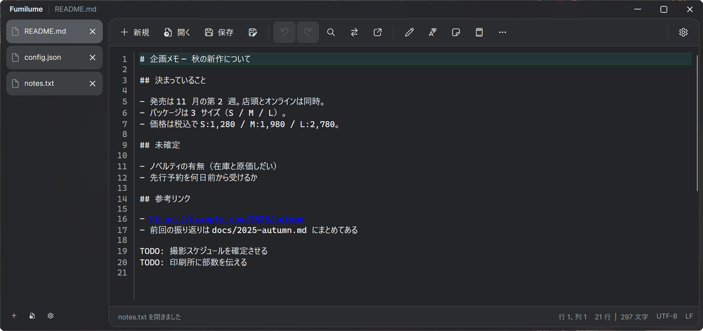

# Fumilume

Fumilume（フミルメ）は、複数の文書を Chrome のような垂直タブで行き来できる、Windows 用の無料テキストエディタです。開いたファイルの文字コードと改行コードを保ったまま編集できます。

[公式サイト](https://fumilume.kagayoi.com/) ・ [Windows x64 版をダウンロード](https://fumilume.kagayoi.com/Fumilume-win-Setup.exe) ・ [Windows ARM64 版をダウンロード](https://fumilume.kagayoi.com/Fumilume-win-arm64-Setup.exe)

## 主な機能

- 開いている文書を見渡しやすい垂直タブと、見出し・ブックマークへ切り替えられる左パネル
- UTF-8、UTF-8 BOM、UTF-16 LE、UTF-16 BE と、CRLF、LF、CR の維持
- 正規表現対応の検索・置換、指定行への移動、行ブックマーク
- フォルダをまたいだ全文検索と、結果一覧からその行へ飛ぶタグジャンプ
- C#、JSON、XML、Markdown など拡張子に応じた構文の色分け（ライト・ダーク両対応）
- 大文字・小文字、全角・半角、ひらがな・カタカナ、Base64、URL エンコードなどの変換
- 行の複製・削除・並べ替え・重複行の整理や、日付・時刻・ファイル情報の挿入
- Markdown の編集と、見出し・リスト・引用・コードブロックなどのプレビュー
- PDF のページ表示、前後移動、25～400% の拡大・縮小
- 行番号、折り返し、空白・タブ・改行記号、桁位置の縦線、VS Code風ミニマップ
- アプリ同梱の IBM Plex Sans JP（UI）と UDEV Gothic JPDOC（エディタ）を既定にした、プレビュー付きのフォント設定
- 未保存のまま終了でき、次回起動時に前回のタブと内容を復元
- すべて保存、ディスクからの開き直し、カーソル行の選択
- 繰り返しの編集を覚えさせて流せるキーボードマクロ（名前を付けて保存できます）
- よく使う操作だけを置いたツールバーと、すべての機能を名前で引けるコマンドパレット
- 項目を名前で絞り込める設定画面
- Windows のライト・ダークテーマへの追従と、アクリル背景
- 対応するファイル拡張子の関連付けと、起動時の自動更新

## インストール

Fumilume は Windows 10 バージョン 1809 以降と Windows 11 に対応しています。追加の .NET ランタイムは必要ありません。

1. 通常の Intel / AMD 搭載 PC では [Windows x64 版](https://fumilume.kagayoi.com/Fumilume-win-Setup.exe) をダウンロードします。
2. Snapdragon などの ARM 搭載 PC では [Windows ARM64 版](https://fumilume.kagayoi.com/Fumilume-win-arm64-Setup.exe) をダウンロードします。
3. ダウンロードした `Setup.exe` を開き、画面の案内に沿ってインストールします。

PC の種類が分からない場合は、Windows の「設定」→「システム」→「バージョン情報」にある「システムの種類」を確認してください。迷った場合は x64 版を選びます。

## 基本的な使い方

1. 左パネル上部の「新しい文書」または「ファイルを開く」から文書を用意します。
2. 複数の文書を開いたときは、左側の垂直タブで切り替えます。
3. ツールバーには「保存」「元に戻す」「やり直す」「検索」だけを置いています。それ以外の機能は、中央の「コマンドを名前で探す」（`Ctrl+Shift+P`）か、編集画面の右クリックメニューから選びます。
4. 編集が終わったら「保存」または「名前を付けて保存」を選びます。

保存していない文書があっても、そのままアプリを閉じられます。次に起動すると、前回終了時のタブ・未保存の内容・カーソル位置が復元されます（タブを 1 枚だけ閉じるときは、これまでどおり保存するかどうかの確認が表示されます）。空き容量不足などで未保存の内容を控えられないときは、内容を失わないようにエラーを表示して終了を中止します。復元が不要な場合は「設定」→「ファイル」→「前回開いていたタブを復元する」をオフにしてください。

`.md` ファイルではツールバーのプレビューボタン、または `Ctrl+Shift+M` で編集画面とプレビューを切り替えられます。`.pdf` ファイルは読み取り専用のタブで開き、上部のボタンからページ移動と拡大・縮小を行えます。

ステータスバー右端の文字コード（`UTF-8` など）と改行コード（`CRLF` / `LF` / `CR`）は、表示をクリックして保存形式を変更できます。

## 左のパネル

タブ一覧の上にある 3 つのボタンで、左側に出すものを切り替えられます。

- **開いているもの**: 開いている文書・PDF・検索結果・設定のタブ一覧です。
- **アウトライン**: 本文から拾った見出しの一覧です。Markdown の見出しと、C# や TypeScript などの型・メンバーの宣言に対応しています。行を選ぶとその場所へ移動し、矢印キーで見出しを辿ると本文が追いかけます。対応していない形式ではその旨を表示します。
- **ブックマーク**: `Ctrl+F2` で付けた印の一覧です。行番号とその行の内容が並び、選ぶとその行へ移動します。

最後に開いていたパネルは次回起動時にも復元されます。
左パネルと本文の境界をドラッグすると、パネル幅を216～480pxの範囲で変更できます。選んだ幅は次回起動時にも復元されます。

## フォルダから探す

`Ctrl+Shift+F`、またはコマンドパレットの「フォルダから探す」から、フォルダ全体を横断して文字列を探せます。

1. 探す文字列、フォルダ、対象にするファイル（`*.txt;*.md` のように `;` で区切ります）を指定します。
2. 結果は専用のタブに一覧で並びます。行をダブルクリックするか `Enter` を押すと、そのファイルが開いてその行へ移動します。
3. 大文字と小文字の区別、正規表現、下のフォルダを含めるかは検索ごとに切り替えられます。指定した条件は次回の初期値として残ります。

画像や実行ファイルなど文字として読めないファイルと、16 MB を超えるファイルは自動的に対象から外れます。一致が 5,000 件に達した時点で打ち切り、その旨を結果の下部に表示します。

## キーボードマクロ

同じ編集を何度も繰り返すときは、一度の操作を覚えさせて流せます。

1. `Shift+F1` を押すと記録が始まります。記録中はステータスバーの左端に赤い丸と手数が出ます。
2. 覚えさせたい編集を普通に行います。文字入力、カーソル移動、選択、削除、`F3` の「次を検索」、ツールバーや右クリックメニューのコマンドが記録されます。
3. もう一度 `Shift+F1` を押すと記録が終わります。
4. `Shift+F5` で実行します。回数を指定して流したいときは、コマンドパレットの「回数を指定してマクロを実行」を選びます。

1 回の実行は全体でひとつの取り消し単位です。何回流しても `Ctrl+Z` 一度で元に戻ります。

コマンドパレットの「マクロに名前を付けて保存」で残しておくと、次に起動したときもパレットから名前で呼び出せます（20 本まで。`%LocalAppData%\Fumilume\macros.json` に保存されます）。

記録されないものが 3 つあります。**マウスでのカーソル移動**、**切り取り・コピー・貼り付け**（クリップボードの中身は実行するときに変わっているため）、**「指定行へ移動」と「パターンに一致する行をマーク」**（実行のたびに入力を尋ねるため）です。

## よく使うショートカット

| 操作 | ショートカット |
| --- | --- |
| 新しい文書 | `Ctrl+N` |
| ファイルを開く | `Ctrl+O` |
| 保存 | `Ctrl+S` |
| 名前を付けて保存 | `Ctrl+Shift+S` |
| 開いている文書をすべて保存 | `Ctrl+Alt+S` |
| ディスクから開き直す | `Ctrl+Shift+R` |
| Markdown プレビューを切り替える | `Ctrl+Shift+M` |
| 現在の文書を閉じる | `Ctrl+W` |
| 元に戻す / やり直す | `Ctrl+Z` / `Ctrl+Y` |
| 検索 / 置換 | `Ctrl+F` / `Ctrl+H` |
| 次 / 前の検索結果 | `F3` / `Shift+F3` |
| 指定行へ移動 | `Ctrl+G` |
| フォルダから探す | `Ctrl+Shift+F` |
| コマンドパレット | `Ctrl+Shift+P` |
| ブックマークを設定・解除 | `Ctrl+F2` |
| マクロの記録を開始・終了 | `Shift+F1` |
| マクロを実行 | `Shift+F5` |
| 設定を開く | `Ctrl+,` |

## 設定

「設定」または `Ctrl+,` から、用途別に次の項目を変更できます。上部の検索欄に言葉を入れると、該当する項目だけが残ります（`Esc` で元に戻ります）。

- **表示**: 行番号、折り返し、記号、桁位置の縦線、行間、構文の色分け、実際の書体を見ながら選べるUI・エディタ別フォント
- **編集**: タブ幅、インデント、矩形選択、上書きモード、コピーやドラッグの動作
- **検索**: 大文字・小文字の区別、正規表現、検索文字列の初期値
- **外観**: ライト・ダークテーマ、アクリル背景、ウィンドウ位置、タブの高さ
- **ファイル**: 前回のタブの復元、カーソル位置の復元、大きなファイルの確認、保存時バックアップ、ファイル関連付け
- **更新と情報**: 起動時の更新確認、手動での更新確認、現在のバージョン

設定は `%LocalAppData%\Fumilume\settings.json` に、前回終了時のタブと未保存の内容は同じフォルダーの `session.json` と `session` フォルダーに、保存したマクロは `macros.json` に保存されます。

## 対応する文字コードとファイル関連付け

開いた文書が UTF-8、UTF-8 BOM、UTF-16 LE、UTF-16 BE のいずれかであれば、保存時も同じ文字コードを維持します。改行コードも CRLF、LF、CR のまま保存されます。

設定画面では、`.txt`、`.md`、`.pdf`、`.log`、`.csv`、`.json` などを Fumilume に関連付けられます。関連付けると、対象ファイルをダブルクリックして Fumilume で開けます。変更は現在の Windows ユーザーだけに適用されます。

## 更新

配布版は起動時に新しいバージョンを確認します。更新が見つかると、ダイアログからダウンロード、適用、再起動まで進められます。

自動確認を無効にした場合や、もう一度確認したい場合は、「設定」→「更新と情報」→「今すぐ更新を確認」を選んでください。

## 困ったときは

- **インストーラーを選べない**: Windows の「システムの種類」が「x64 ベース」の場合は x64 版、「ARM ベース」の場合は ARM64 版を使います。
- **文字化けする**: 対応している文字コードは UTF-8、UTF-8 BOM、UTF-16 LE、UTF-16 BE です。それ以外の文字コードで保存されたファイルは、あらかじめ対応形式へ変換してください。
- **更新を確認できない**: インターネット接続を確認し、「設定」→「更新と情報」から再度確認してください。
- **動作状況を確認したい**: ログは `%LocalAppData%\Fumilume\logs` に日付ごとに保存されます。問い合わせ時に該当日のログを添付すると原因を確認しやすくなります。
- **不具合や要望を伝えたい**: [GitHub Issues](https://github.com/1llum1n4t1s/Fumilume/issues) から報告できます。

変更内容は [変更履歴](CHANGELOG.md) で確認できます。

## ライセンス

Fumilume は MIT License で公開されています。詳しくは [LICENSE](LICENSE) を参照してください。
